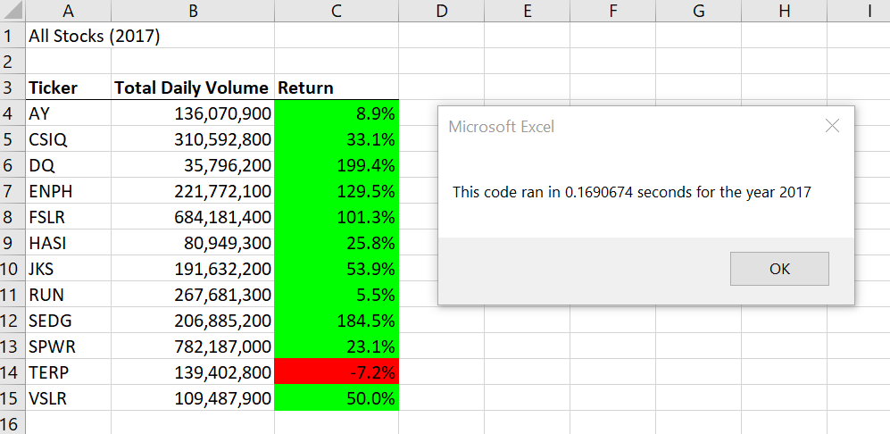
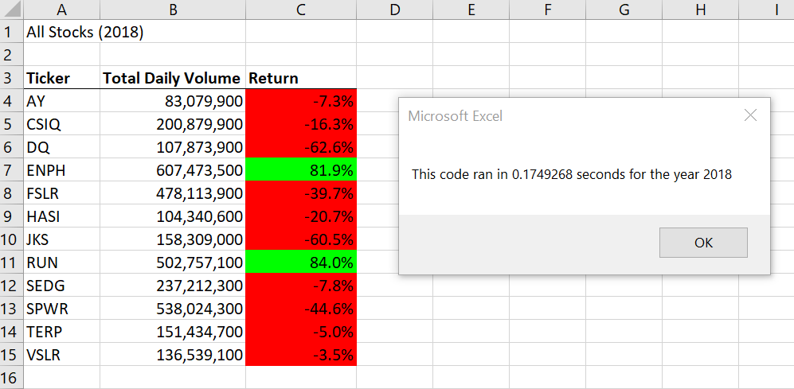

# Stock Analysis with VBA

## Overview of Project

### Background

Steve has just graduated his finance degree and is helping his parents invest in green energy stocks. His parents are passionate about alternative energy and were particularly interested in stocks of a company called **DAQO New Energy Corp** (ticker symbol: **DQ**). In additional to analysing the DQ stocks, Steve also wants to analyze some other green energy stocks in order to diversify their funds. He has created an Excel sheet with stock data and has asked me to help him in his analysis. I am using Visual Basic for Applications, or VBA, to perform the analysis as it automates the tasks usually performed in Excel and enhance its functionality. This in turn decreases the probability of error and reduces the time taken to run the analysis. 

### Purpose
Steve liked the workbook i created for him earlier using VBA as it allowed him to analyze a dozen stocks with a simple click of a button. But now, he wants to analyze the entire stock market data. However, analyzing a large amount of stock data will require the VBA script to run faster. Therefore, i am "refactoring" the code created earlier to reduce the run time. Refactoring a process of rewriting and cleaning up the code so that it is more efficient and extensible without adding any new functionality.

## Results 

### Stock Analysis for 2017

### Stock Analysis for 2018

### Stock Performance: 2017 vs 2018

1. In 2017, 11 out of 12 green energy stocks analyzed had *positive* return. Whereas in 2018, only 2 out of 14 had positive return.
2. ENPH seems *best* stock to invest as it had good positive return in both 2017 (129.5%) and 2018 (81.9%). RUN was another stock which provided positive return in both the years, though its 2017 return wasn't high (5.5%).
3. TERP gave *negative* returns in both 2017 and 2018. Therefore, it should be avoided.
4. DQ provided best return in 2017 (199.4%) but the worse return in 2018 (-62.6%). Therefore, it has the *highest variation* and hence needs to be studied further before investing.
5. The *average return* of the given 12 green energy stocks was 67.3% for 2017, and -8.5% for 2018. Overall, 2017 was *good* year for green energy stocks but 2018 was *not good*.  

### Code Refactoring Performance

**For 2017**
* The time taken to run the *original code* was **0.8389893** seconds for 2017
* The time taken to run the *refactored code* was **0.1690674** seconds for 2017
* Therefore, refactored code took only **20.1%** of time taken by original code to run. In other words, refactoring reduced the code run time to **1/5th** of original.

**For 2018**
* The time taken to run the *original code* was **0.8289795** seconds for 2018
* The time taken to run the *refactored code* was **0.1749268** seconds for 2018
* Refactored code took only **21.1%** of time taken by original code to run. It means that the original code took **4.73 times** longer to run than refactored code

***Conclusion: Refactoring significantly reduces the time taken to run the code.***

### Steps Involved in Refactoring the Code

1. In in the original code, i used nested `for` loops. The inner loop looped over the rows in stocks data storing the values of Ticker Total Volume, Ticker Starting Price, and Ticker Ending Price in different variables. The outer loop was used for output.
2. In refactored code, i didn't use the nested loops. Instead we created `tickerIndex` variable and used it as index to access the `tickers` array and three other output arrays.
3. Three new output arrays `tickerVolumes`, `tickerStartingPrices`, and `tickerEndingPrices` were created to store volume, starting price, and ending price for each ticker/stock. The first one is of Long data type and the other two are Single data type.
4. The `tickerVolumes` array is initialized to 0 using a `for` loop.
5. Once the above loop finishes, the tickerIndex is set 0 and a second `for` loop is created to loop over all the rows in the stock data sheet.
6. `if-then` statements are used to calculate the stock ticker volume, ticker starting price, and ticker closing price and storing these in `tickerVolumes`, `tickerStartingPrices`, and `tickerEndingPrices` arrays respectively just like we did in original code.
7. Once the second loop finishes, a third `for` loop is used for output in "All Stocks Analysis" sheet using the output arrays.        

## Summary

### What are the advantages or disadvantages of refactoring code?
Given below are **advantages** of refactoring code:
1. *Efficiency:* It makes code more efficient and faster by removing duplicate code, complexities, and other programming discrepancies.  
2. *Readability:* It makes the code more readable by breaking down large routines into smaller and more concise methods, naming the methods meaningfully, and adding appropriate comments. This is helpful in situations where a number of developers will be working on same code 
3. *Maintainability:* Improving readability improves the maintainability by helping catch the bugs and errors more easily.
4. *Extensibility:* Code refactoring also involves coding design patterns wherever possible. This improves felxibility and helps add any additional functionality of the code later.

Given below are **disadvantages** of refactoring code:

1. *Time Consuming:* Refactoring code may require a lot of time and efforts especially if a large amount of code has already been written.
2. *Cost:* High expertise is required in order to refactor the code. This can increase the overall cost.  

### How do these pros and cons apply to refactoring the original VBA script?
**Pros:**
1. *Improved Speed:* Refactoring reduced the time taken to run the code by around 80%. I.e. refactored code only took about 1/5th of the original time to run.
2. *Extensibility:* Storing the vlaues for ticker volumes, ticker starting prices, and ticker ending prices in arrays allows us to use these values later if we decide to expand the code and include new functionality.  
3. *Readability:* Removing the nested loops and creating separate loop for output improved the readability of the code.

**Cons:**
1. *More Memory Usage:* Creating output arrays will take up more memory space as compared to the original code.

  
